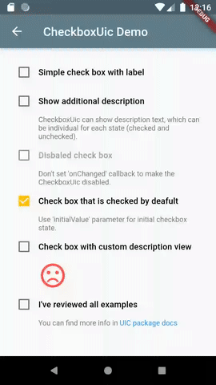
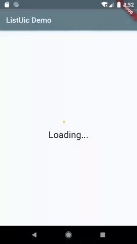
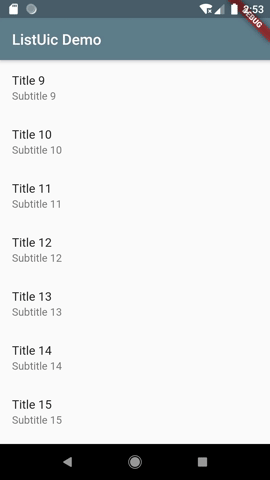
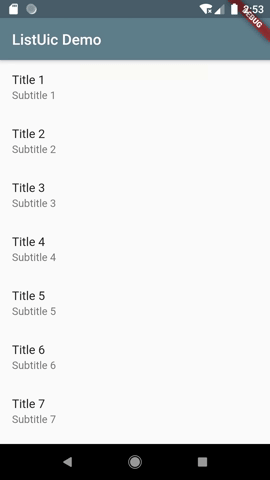
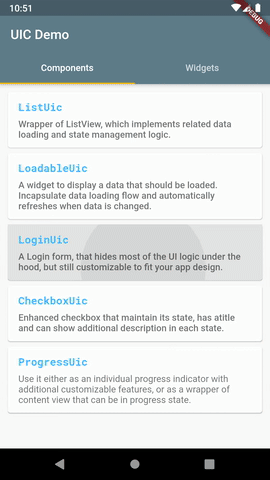
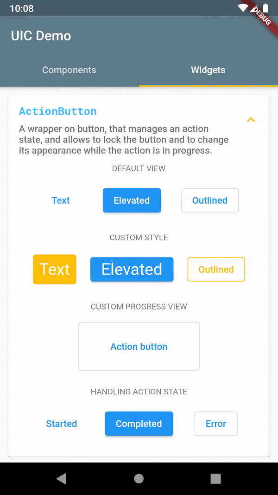
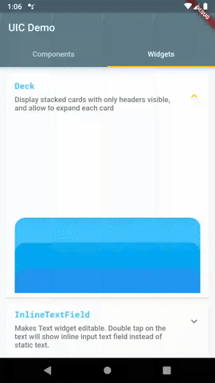
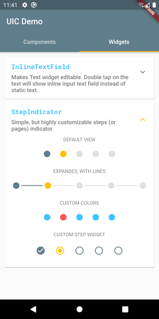

# UIC (UI Components)

A set of Flutter widgets for easier implementation of most used UI features.

####  Components:
- [CheckboxUic](#checkboxuic) - Enhanced **Checkbox** that maintain its state, has a title and can show additional description in each state.
- [ListUic](#listuic) - Wrapper of **ListView**, which implements related data loading and state management logic.
- [LoginUic](#loginuic) - A Login form, that hides most of the UI logic under the hood, but still customizable to fit your app design.
- `ProgressUic` - Wrapper of **ProgressIndicator** with additional text.

####  Widgets:
- [ActionButton](#actionbutton) - Wrapper of Material button, that manages a state of an action which is performed on the button click, and shows progress while the action is performed.
- [Deck](#deck) - Shows stacked cards, that can be expanded and collapsed.
- [InlineTextField](#inlinetextfield) - Text view with ability to inline edit its content.
- [StepIndicator](#stepindicator) - Simple, but customizable step/page indicator.

# [CheckboxUic](#checkboxuic)
Enhanced, but still simple, checkbox widget. Unlike original Checkbox widget, **CheckboxUic** maintain its state. Also it has a title and can show an additional description.

- Supports all original parameters of Checkbox Flutter widget
- Has initial value
- Shows a title, which can be individual for checked and unchecked state
- Optionally shows additional text description, which can be individual for checked and unchecked state
- Supports custom widgets instead of text description



### Usage

Import the package

```dart
import 'package:uic/checkbox_uic.dart';
```

Simple usage of `CheckboxUic`:

<pre><code>
  @override
  Widget build(BuildContext context) {
    return Scaffold(
      appBar: AppBar(
        title: Text(widget.title),
      ),
      body: <b>CheckboxUic(
          initialState: true,
          title: 'Show additional description',
          description: 'This is description for checked state.',
          descriptionUnchecked: 'CheckboxUic can show description text, which can be '
              'individual for each state (checked and unchecked).',
          onChanged: (value) {
            print('$value');
          },
      ),</b>
    );
  }
</code></pre>

See more examples in [demo app](https://github.com/ech89899/uic-flutter/tree/master/example/lib/checkboxuic_screen.dart).

# [ListUic](#listuic)

Almost each app has screens that display a list of items. Simple task at first look, it often requires much related staff to be implemented. All that boilerplate can be simplified with **ListUic** widget.

#### Features:
- Pull to Refresh gesture to reload list data
- Pagination (infinite scroll) to load next part of data on scroll to the end of the list
- Progress indicator for initial data loading
- Individual view for empty data
- Individual error view
- Progress indicator at the end of list when next page of items is loading
- Showing snack bar on failing loading data

&nbsp;&nbsp;

### Usage

Import the package

```dart
import 'package:uic/list_uic.dart';
```

Add `ListUicController` to your page's state:

<pre><code>
class _MyHomePageState extends State&lt;MyHomePage&gt; {

  <b>ListUicController&lt;int&gt; _controller;</b>
  ...

  @override
  void initState() {
    super.initState();
    <b>_controller = ListUicController&lt;int&gt;(
      onGetItems: (int page) => _getItems(page),
    );</b>
    ...
  }
  ...
}
</code></pre>

Add `ListUic` widget to your widget tree:

<pre><code>
  @override
  Widget build(BuildContext context) {
    return Scaffold(
      appBar: AppBar(
        title: Text(widget.title),
      ),
      body: <b>ListUic&lt;int&gt;(
        controller: _controller,
        itemBuilder: (item) {
          return ListTile(
            title: Text('Title ${item}'),
            subtitle: Text('Subtitle ${item}'),
          );
        },
      ),</b>
    );
  }
</code></pre>

Implement a function that will return a list of items:

<pre><code>
  Future&lt;List&lt;int&gt;&gt; _getItems(int page) async {
    ...
  }
</code></pre>

Read the docs for available customization options.

Also you can check [demo app](https://github.com/ech89899/uic-flutter/tree/master/example) for details of using `ListUic` widget.

# [LoginUic](#loginuic)

A Login form, that encapsulates most of UI logic for 'Sign in' feature, but still highly customizable to fit your app design.

#### Features:
- Displays a standard sign in form with username and password fields, and 'Sign In' button
- Implements basic username and password validation logic
- Provides a callback to perform the signing in action
- Handles signing in errors
- Allows to customize the form UI according to your app design



### Usage

Import the package

```dart
import 'package:uic/login_uic.dart';
```

Add `LoginUic` widget to your widget tree:

<pre><code>
  @override
  Widget build(BuildContext context) {
    return Scaffold(
      appBar: AppBar(
        title: Text(widget.title),
      ),
      body: Center(
        child: <b>LoginUic(
          onSignIn: (username, password) => _signIn(username, password),
          onSignInCompleted: (context) => Navigator.push(
            context,
            MaterialPageRoute(
                builder: (context) =>
                    LoginUicSignedInScreen(title: 'LoginUic Demo')),
          ),</b>
        ),
      ),
    );
  }
</code></pre>

Implement a function that performs sign in action according to your business logic:

<pre><code>
  Future&lt;void&gt; _signIn(String username, String password) async {
    ...
  }
</code></pre>

`LoginUic` required parameters:

| Name | Description |
|---|---|
| `onSignIn`  | A callback that perform sign in action. It is called when users clicks 'Sign In' button.
| `onSignInCompleted`  | Called when a user successfully signed in. Can be used to navigate to another screen.

See full example of **LoginUic** usage in the [demo app](https://github.com/ech89899/uic-flutter/tree/master/example/lib/main.dart) and package docs.

# [ActionButton](#actionbutton)

A wrapper of Material buttons, that incapsulates managing of the local state of an action which is
performed on the button click, and updates the button content to display the progress view when the action is performed.

- Uses TextButton, ElevatedButton or OutlineButton as an underlying button widget.
- Supports all attributes of standard buttons.
- Allows to display a simple progress indicator or a custom view when the action is performed.
- Provides callbacks on action state changes.



### Usage

Import the package

```dart
import 'package:uic/widgets.dart';
```

You can use `ActionButton` the same way you are using normal button widgets. But instead of 'onPressed', you provide action function in the `action` attribute.

<pre><code>
  @override
  Widget build(BuildContext context) {
    return Scaffold(
      appBar: AppBar(
        title: Text(widget.title),
      ),
      body: Center(
        child: <b>ActionButton(
          action: () async {
            return Future.delayed(Duration(seconds: 5));
          },
          child: Text('Button title'),
        ),</b>
      ),
    );
  }
</code></pre>

Additional parameters of `ActionButton` widget:

| Name | Description |
|---|---|
| `buttonType`  | Defines the underlying Material button widget - TextButton, ElevatedButton or OutlineButton.
| `onActionCompleted`  | Called when the action successfully completed.
| `onActionError`  | Called when the action finished with error.
| `onActionStarted`  | Called immediately after the button pressed.
| `progressView`  | Custom view that is shown as a button child during the action.

See full example of **ActionButton** usage in the [demo app](https://github.com/ech89899/uic-flutter/tree/master/example/lib/main.dart) and package docs.

# [Deck](#deck)

Displays stacked child widgets (typically cards), so the only headers are visible
initially. Each `Deck` item can be expanded and collapsed.

This is an alternative to a BottomSheet widget, if you need to display multiple bottom sheets, which are coordinated.

- Supports separate views for collapsed and expanded state for each item.
- Animates expanding and collapsing.



### Usage

Import the package

```dart
import 'package:uic/widgets.dart';
```

Typically you will use `Deck` in a Stack, where the first layer is your main content and a `Deck` will overlap the conten.
The usage might look like this:

<pre><code>
  @override
  Widget build(BuildContext context) {
    return Scaffold(
      appBar: AppBar(
        title: Text(widget.title),
      ),
      body: Stack(
        children: [
          YourMainWidget(),
          Align(
            alignment: Alignment.bottomCenter,
            child: <b>Deck(
                items: [
                  DeckItem(
                    child: YourFirstItemCollapsedView(),
                    childExpanded: YourFirstItemExpandedView(),
                  ),
                  DeckItem(
                    child: YourSecondItemCollapsedView(),
                    childExpanded: YourSecondItemExpandedView(),
                  ),
                ],
            ),</b>
          ),
        ]),
    );
  }
</code></pre>

You must provide the list of `DeckItem` objects, which defines both the collapsed and expanded appearance of your Deck items.

Additional parameters of `Deck` widget:

| Name | Description |
|---|---|
| `collapsedSize`  | The size of child widget in the collapsed state.
| `expandedSize`  | The size of child widget in the expanded state.
| `mainAxisSize`  | The maximum Deck size.

See full example of **Deck** usage in [demo app](https://github.com/ech89899/uic-flutter/tree/master/example/lib/main.dart) and package docs.

# [InlineTextField](#inlinetextfield)

Makes Text view editable. In the view mode is shows a normal Text widget (or your custom view). On double tap it is switching to editing mode, and allow user to inline edit the text.

- Supports text styling in both view and editing mode.
- Supports text field decoration in the editing mode.
- Uses minimalistic appearance of text field in editing mode by default.
- Notifies when user done editing text.
- Supports custom widget to show in view mode instead of normal Text widget.


### Usage

Import the package

```dart
import 'package:uic/widgets.dart';
```

Simple usage of `InlineTextWidget`:

<pre><code>
  @override
  Widget build(BuildContext context) {
    return Scaffold(
      appBar: AppBar(
        title: Text(widget.title),
      ),
      body: Row(
          children: &lt;Widget&gt;[
            Text('You can '),
            <b>InlineTextField(
              text: 'edit me',
              style: Theme.of(context).textTheme.bodyText1.copyWith(
                color: Colors.lightBlueAccent,
              ),
              onEditingComplete: (value) {
                _scaffoldKey.currentState.showSnackBar(SnackBar(
                  backgroundColor: Theme.of(context).accentColor,
                  content: Text(value),
                ));
              },
            )</b>,
            Text(' right here'),
          ],
        ),
    );
  }
</code></pre>

See more available options of **InlineTextField** examples in [demo app](https://github.com/ech89899/uic-flutter/tree/master/example/lib/main.dart) and package docs.

# [StepIndicator](#stepindicator)

Simple, but customizable step (page) indicator. It can be useful to show a current item in sliders and carousels, or a current page in a flow where user has to pass through a sequence of screens.

- Supports custom colors for completed, selected and incomplete steps.
- Optionally shows lines connecting step items.
- Supports custom line colors, width and length.
- Can be expanded, to fit parent size.
- *Horizontal or vertical orientation (NOT IMPLEMENTED YET)*
- *Notifies when user select a step. (NOT IMPLEMENTED YET)*
- Supports custom widgets for complete, selected and incomplete steps.
- *Builder function that allow to define individual view for each step. (NOT IMPLEMENTED YET)*



### Usage

Import the package

```dart
import 'package:uic/widgets.dart';
```

Simple usage of `StepIndicator`:

<pre><code>
  @override
  Widget build(BuildContext context) {
    return Scaffold(
      appBar: AppBar(
        title: Text(widget.title),
      ),
      body: Padding(
        padding: const EdgeInsets.all(16.0),
          child: <b>StepIndicator(
            selectedStepIndex: 2,
            totalSteps: 5,
          ),</b>
        ),
    );
  }
</code></pre>

You must provide the current step index and total number of steps.

See more available options of **StepIndicator** in [demo app](https://github.com/ech89899/uic-flutter/tree/master/example/lib/main.dart) and package docs.
